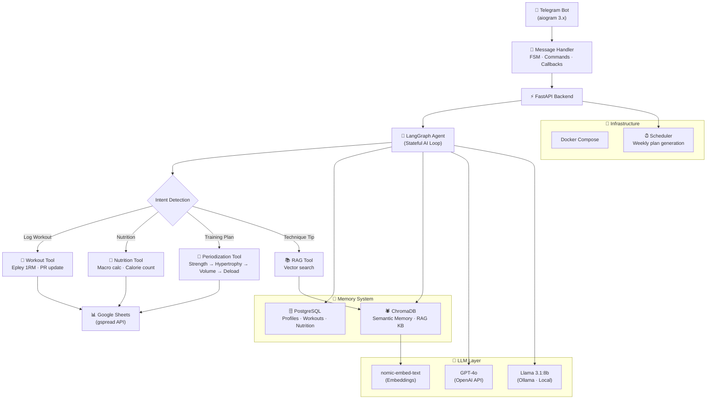

# 🏗️ AI Personal Trainer

An intelligent, AI-powered personal training assistant that helps users track workouts, analyze progress, manage nutrition, and generate personalized training plans with automated periodization.

---

## 🚀 Overview

The **AI Personal Trainer** is more than just a logging app. It's a sophisticated AI agent built on **LangGraph** and **LangChain** that acts as a real-life coach. It remembers your injuries, calculates your 1RM (One Rep Max) trends, adapts your training volume based on fatigue, and provides technical tips using a **RAG (Retrieval-Augmented Generation)** knowledge base.

---

## 🏗️ Architecture



---

## ✨ Key Features

- **Smart Workout Logging**: Log exercises via Telegram. The AI automatically updates your Personal Records (PRs) and calculates 1RM using the Epley formula.
- **Automated Periodization**: Generates weekly plans following a 4-week cycle: **Strength → Hypertrophy → Volume → Deload**.
- **Nutrition Tracking**: Send a natural language description of your meal (e.g., "200g of boiled buckwheat and 150g of grilled chicken"), and the AI calculates macros (Calories, Protein, Carbs, Fats).
- **Long-Term Memory**: Remembers user preferences, injuries, and past performance using a hybrid memory system (PostgreSQL + ChromaDB).
- **RAG Knowledge Base**: Provides expert advice on exercise technique and common errors sourced from vetted fitness data.
- **Google Sheets Integration**: Automatically mirrors all progress to a personalized Google Sheet for deep data visualization.

---

## 🛠 Tech Stack

| Category | Technology |
|---|---|
| **Language** | Python 3.11+ |
| **AI Framework** | LangGraph, LangChain |
| **LLM** | OpenAI GPT-4o (Cloud) or Llama 3.1 (Local via Ollama) |
| **Database** | PostgreSQL (Relational), ChromaDB (Vector/Semantic Memory) |
| **Bot Framework** | aiogram 3.x |
| **API** | FastAPI |
| **Integration** | Google Sheets API (gspread) |
| **Deployment** | Docker & Docker Compose |

---

## 📂 Project Structure

```text
ai_trainer/
├── agent/               # AI Agent Core (LangGraph, Tools, Memory)
│   ├── tools/           # Custom tools for DB, Sheets, and Nutrition
│   └── prompts/         # System instructions and templates
├── api/                 # FastAPI Backend
├── bot/                 # Telegram Bot logic (Handlers, FSM, Keyboards)
├── db/                  # SQLAlchemy Models and CRUD operations
├── rag/                 # RAG System (Knowledge base & Vector search)
├── sheets/              # Google Sheets integration logic
├── scheduler/           # Background tasks (Weekly plan generation)
└── scripts/             # Initialization and utility scripts
```

---

## ⚙️ How It Works

### 1. The AI Agent Loop
The core logic uses **LangGraph** to maintain a stateful conversation. When you send a message, the agent:
1. **Loads Profile**: Pulls your stats, goals, and injuries from PostgreSQL.
2. **Retrieves Context**: Searches ChromaDB for relevant past "memories" or technical exercise data.
3. **Executes Tools**: Depending on intent, it might log a workout, calculate calories, or update a sheet.
4. **Updates Memory**: Stores new insights about you back into the semantic memory.

### 2. Training Progression
The system uses **Linear Periodization**. It tracks your performance across weeks. If you hit all reps in a strength block, the AI automatically suggests a +2.5kg increase for the next cycle.

---

## 🛠 Installation & Setup

### Prerequisites
- Docker & Docker Compose
- Telegram Bot Token (from [@BotFather](https://t.me/botfather))
- OpenAI API Key (optional, if not using Ollama)
- Google Service Account `credentials.json` (for Sheets integration)

### Deployment

1. **Clone the repository**:
   ```bash
   git clone https://github.com/Totsamuychel/AI_Personal_Trainer.git
   cd AI_Personal_Trainer
   ```

2. **Configure Environment**:
   ```bash
   cp .env.example .env
   # Edit .env with your tokens and passwords
   ```

3. **Launch Infrastructure**:
   ```bash
   docker-compose up -d postgres ollama
   ```

4. **Initialize Models & Data**:
   ```bash
   # Pull LLM models if using Ollama
   docker exec -it ollama ollama pull llama3.1:8b
   docker exec -it ollama ollama pull nomic-embed-text

   # Run DB migrations and seed RAG
   docker-compose run --rm api alembic upgrade head
   docker-compose run --rm api python scripts/init_knowledge_base.py
   ```

5. **Start the Application**:
   ```bash
   docker-compose up -d
   ```

---

## 🤖 Bot Commands

- `/start` - Initial registration and profile setup.
- `/workout` - Start an interactive workout logging session.
- `/plan` - View your generated training plan for the current week.
- `/nutrition` - Log meals via text description.
- `/progress` - View your 1RM trends and training volume.
- `/tip [exercise]` - Get technique advice from the RAG knowledge base.

---

## 🗺 Roadmap

- [ ] **v1.0**: MVP with Telegram interface and Google Sheets mirror (Current).
- [ ] **v1.1**: Computer Vision for exercise technique analysis (MediaPipe).
- [ ] **v1.2**: Food photo recognition for automatic macro tracking.
- [ ] **v2.0**: Native Mobile App (React Native) with offline-first local LLM.

---
*Created by [Totsamuychel](https://github.com/Totsamuychel)*
